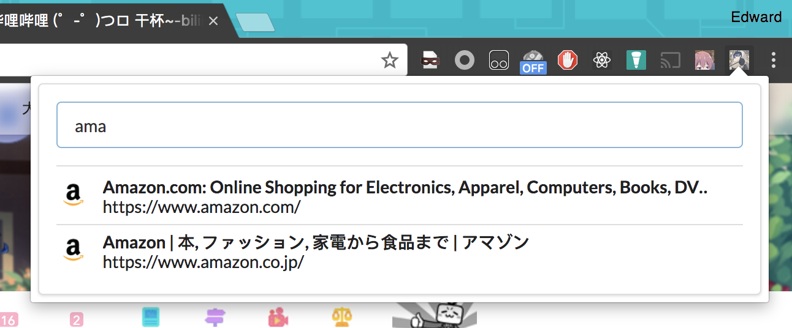

# Chrome-ctrlp

CtrlP Extension for Chrome

## Usage

Input pattern (applied to tab titles & URLs) and use `up` & `down` to move among tab items, then:

    - Enter         : Open selected tab
    - Ctrl-W        : Close selected Tab
    - Ctrl-Shift-W  : Close tabs other than the selected tab
    - Alt-Shift-W   : Close all tabs in the result

### Install

1. `git clone` this repo
2. drag-n-drop the repo folder to Chrome Extension Settings (chrome://extensions)

### Setting open shortcut

The default shortcut to open this extension is `Ctrl+P` for MacOS (credit: @GarfieldZHU). For other cases:

Goto Chrome Extension Shortcuts Settings (chrome://extensions/shortcuts) and set shortcut (e.g. `Ctrl+P`) for this extension.

## TODO

More comfortable item scroll.
